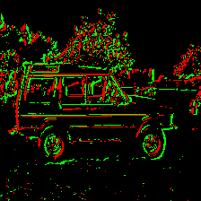
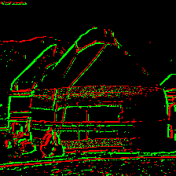

<div align="center">

<h1>I2E: Real-Time Image-to-Event Conversion for High-Performance Spiking Neural Networks</h1>

<!-- Badges -->
[](https://arxiv.org/abs/2511.08065)
[](https://aaai.org/)
[](https://scholar.google.com/scholar?cluster=1814482600796011970)
[](https://huggingface.co/Ruichen0424/I2E)

</div>

<br>

## 🚀 Introduction

This is the official PyTorch implementation of the paper **I2E: Real-Time Image-to-Event Conversion for High-Performance Spiking Neural Networks**, accepted for **Oral Presentation** at **AAAI 2026**.

**I2E** is a pioneering framework that bridges the data scarcity gap in neuromorphic computing.
By simulating microsaccadic eye movements via highly parallelized convolution, I2E converts static images into high-fidelity event streams in real-time (>300x faster than prior methods).

### ✨ Key Highlights
* **SOTA Performance**: Achieves **60.50%** top-1 accuracy on Event-based ImageNet.
* **Sim-to-Real Transfer**: Pre-training on I2E data enables **92.5%** accuracy on real-world CIFAR10-DVS, establishing a new SOTA benchmark.
* **Real-Time Conversion**: Uniquely enables on-the-fly data augmentation for deep SNN training.

## 📄 Abstract
Spiking neural networks (SNNs) promise highly energy-efficient computing, but their adoption is hindered by a critical scarcity of event-stream data.
This work introduces I2E, an algorithmic framework that resolves this bottleneck by converting static images into high-fidelity event streams.
By simulating microsaccadic eye movements with a highly parallelized convolution, I2E achieves a conversion speed over 300x faster than prior methods, uniquely enabling on-the-fly data augmentation for SNN training.
The framework's effectiveness is demonstrated on large-scale benchmarks.
An SNN trained on the generated I2E-ImageNet dataset achieves a state-of-the-art accuracy of 60.50%.
Critically, this work establishes a powerful sim-to-real paradigm where pre-training on synthetic I2E data and fine-tuning on the real-world CIFAR10-DVS dataset yields an unprecedented accuracy of 92.5%.
This result validates that synthetic event data can serve as a high-fidelity proxy for real sensor data, bridging a long-standing gap in neuromorphic engineering.
By providing a scalable solution to the data problem, I2E offers a foundational toolkit for developing high-performance neuromorphic systems.
The open-source algorithm and all generated datasets are provided to accelerate research in the field.

## 👁️ Visualization

Below is the visualization of the conversion process from static RGB images to dynamic event streams. We illustrate the high-fidelity conversion with four examples.

<table border="0" style="width: 100%">
  <tr>
    <td width="25%" align="center"></td>
    <td width="25%" align="center"></td>
    <td width="25%" align="center"></td>
    <td width="25%" align="center"></td>
  </tr>
  <tr>
    <td width="25%" align="center"></td>
    <td width="25%" align="center"></td>
    <td width="25%" align="center"></td>
    <td width="25%" align="center"></td>
  </tr>
</table>

## 📂 Datasets

We provide the converted event-based datasets generated by I2E, including **I2E-CIFAR10**, **I2E-CIFAR100**, and **I2E-ImageNet**. These datasets significantly facilitate research on event-stream data by providing high-quality, large-scale benchmarks.

If you require raw event stream data, we strongly encourage using the code provided in [`./Dataset Transformation`](./Dataset%20Transformation/) to generate it yourself, as generation is significantly faster than downloading.
This folder contains the generation code for all I2E datasets.

> **Note:** We will continuously update and release I2E versions of other common static image datasets. If you have any requests, please feel free to open an issue.

**Download Links:**

[](https://pan.baidu.com/s/1G1J6MG0d_NFQuoTxR7YLWQ?pwd=ItoE)

## 🛠️ Requirements

- python==3.10
- pytorch==2.2.0
- torchvision==0.17.0
- spikingjelly (dev version between 0.0.0.0.14 and 0.0.0.1.0)
- timm==1.0.19

### Environment Setup

We recommend using Anaconda to create a virtual environment:

```bash
conda create -n i2e python=3.10
conda activate i2e
```

Install PyTorch and dependencies:

```bash
# Install PyTorch (Choose based on your CUDA version)
# CUDA 11.8
conda install pytorch==2.2.0 torchvision==0.17.0 torchaudio==2.2.0 pytorch-cuda=11.8 -c pytorch -c nvidia

# Install SpikingJelly and timm
pip install timm==1.0.19
pip install spikingjelly
```


## 💻 Usage

All training scripts are located in the [`./Train Script`](./Train%20Script/) folder. We provide training code for [**Baseline-I**](./Train%20Script/Baseline-I/), [**Baseline-II**](./Train%20Script/Baseline-II/), and [**DVS-CIFAR10**](./Train%20Script/DVS_CIFAR10/), as well as [inference code](./Train%20Script/Inference/) for all provided weights.

### Training (Baseline-II)
To train the models using the Baseline-II setting (with full augmentation), use the following commands. Please ensure you update the `--dataset_path` (or `-dp`) argument to point to your local dataset location.

**CIFAR-10**
```bash
python train.py -bz 128 -dp '/path/to/CIFAR10/' --dataset 'cifar10' -n 'CIFAR10' -cn 10 -e 256 --lr 0.1 --lr_min 5e-5 -wd 2e-4 --label_smooth 0.1 --model 'resnet18' --ratio 0.07 --shuffle 4 -p 30
```

**CIFAR-100**
```bash
python train.py -bz 128 -dp '/path/to/CIFAR100/' --dataset 'cifar100' -n 'CIFAR100' -cn 100 -e 256 --lr 0.1 --lr_min 5e-5 -wd 2e-4 --label_smooth 0.1 --model 'resnet18' --ratio 0.07 --shuffle 4 -p 30
```

**ImageNet**
```bash
python train.py -bz 128 -dp '/path/to/ImageNet/' --dataset 'imagenet' -n 'ImageNet' -cn 1000 -e 128 --lr 0.1 --lr_min 5e-5 -wd 1e-5 --label_smooth 0.1 --model 'resnet18' --ratio 0.12 --shuffle 4 -p 200 --multiprocessing_distributed
```


## 🤖 Pre-trained Models
We provide pre-trained models for I2E-CIFAR and I2E-ImageNet.

- [](https://huggingface.co/Ruichen0424/I2E)
- [](https://pan.baidu.com/s/1IFyfL8EwtPCEcu73xmx13Q?pwd=ItoE)


## 📊 Main Results & Model Zoo
The experimental settings for the methods listed below are as follows:
- **Baseline-I**: Training from scratch with minimal augmentation.
- **Baseline-II**: Training from scratch with full augmentation (random crop, etc.), enabled by I2E.
- **Transfer-I**: Fine-tuning on target dataset after pre-training on a source dataset.
- **Transfer-II**: Fine-tuning on target dataset after pre-training on **I2E-CIFAR10**.

<table>

<tr>
<th>Dataset</th>
<th align="center">Structure</th>
<th align="center">Method</th>
<th align="center">Top-1 Acc</th>
<th align="center">Downloadable</th>
</tr>

<tr>
<td rowspan=3 align="center"><strong>CIFAR10-DVS</strong></td>
<td align="center">MS-ResNet18</td>
<td align="center">Baseline</td>
<td align="center">65.6%</td>
<td align="center">&#x2714;</td>
</tr>
<tr>
<td align="center">MS-ResNet18</td>
<td align="center">Transfer-I</td>
<td align="center">83.1%</td>
<td align="center">&#x2714;</td>
</tr>
<tr>
<td align="center">MS-ResNet18</td>
<td align="center">Transfer-II</td>
<td align="center"><strong>92.5%</strong></td>
<td align="center">&#x2714;</td>
</tr>

<tr>
<td rowspan=3 align="center"><strong>I2E-CIFAR10</strong></td>
<td align="center">MS-ResNet18</td>
<td align="center">Baseline-I</td>
<td align="center">85.07%</td>
<td align="center">&#x2714;</td>
</tr>
<tr>
<td align="center">MS-ResNet18</td>
<td align="center">Baseline-II</td>
<td align="center">89.23%</td>
<td align="center">&#x2714;</td>
</tr>
<tr>
<td align="center">MS-ResNet18</td>
<td align="center">Transfer-I</td>
<td align="center"><strong>90.86%</strong></td>
<td align="center">&#x2714;</td>
</tr>

<tr>
<td rowspan=3 align="center"><strong>I2E-CIFAR100</strong></td>
<td align="center">MS-ResNet18</td>
<td align="center">Baseline-I</td>
<td align="center">51.32%</td>
<td align="center">&#x2714;</td>
</tr>
<tr>
<td align="center">MS-ResNet18</td>
<td align="center">Baseline-II</td>
<td align="center">60.68%</td>
<td align="center">&#x2714;</td>
</tr>
<tr>
<td align="center">MS-ResNet18</td>
<td align="center">Transfer-I</td>
<td align="center"><strong>64.53%</strong></td>
<td align="center">&#x2714;</td>
</tr>

<tr>
<td rowspan=4 align="center"><strong>I2E-ImageNet</strong></td>
<td align="center">MS-ResNet18</td>
<td align="center">Baseline-I</td>
<td align="center">48.30%</td>
<td align="center">&#x2714;</td>
</tr>
<tr>
<td align="center">MS-ResNet18</td>
<td align="center">Baseline-II</td>
<td align="center">57.97%</td>
<td align="center">&#x2714;</td>
</tr>
<tr>
<td align="center">MS-ResNet18</td>
<td align="center">Transfer-I</td>
<td align="center">59.28%</td>
<td align="center">&#x2714;</td>
</tr>
<tr>
<td align="center">MS-ResNet34</td>
<td align="center">Baseline-II</td>
<td align="center"><strong>60.50%</strong></td>
<td align="center">&#x2714;</td>
</tr>

</table>

## 📜 Citation
If you find our code useful for your research, or use the I2E algorithm, or use the provided I2E-Datasets, please consider citing:

```bibtex
@article{ma2025i2e,
  title={I2E: Real-Time Image-to-Event Conversion for High-Performance Spiking Neural Networks},
  author={Ma, Ruichen and Meng, Liwei and Qiao, Guanchao and Ning, Ning and Liu, Yang and Hu, Shaogang},
  journal={arXiv preprint arXiv:2511.08065},
  year={2025}
}
```